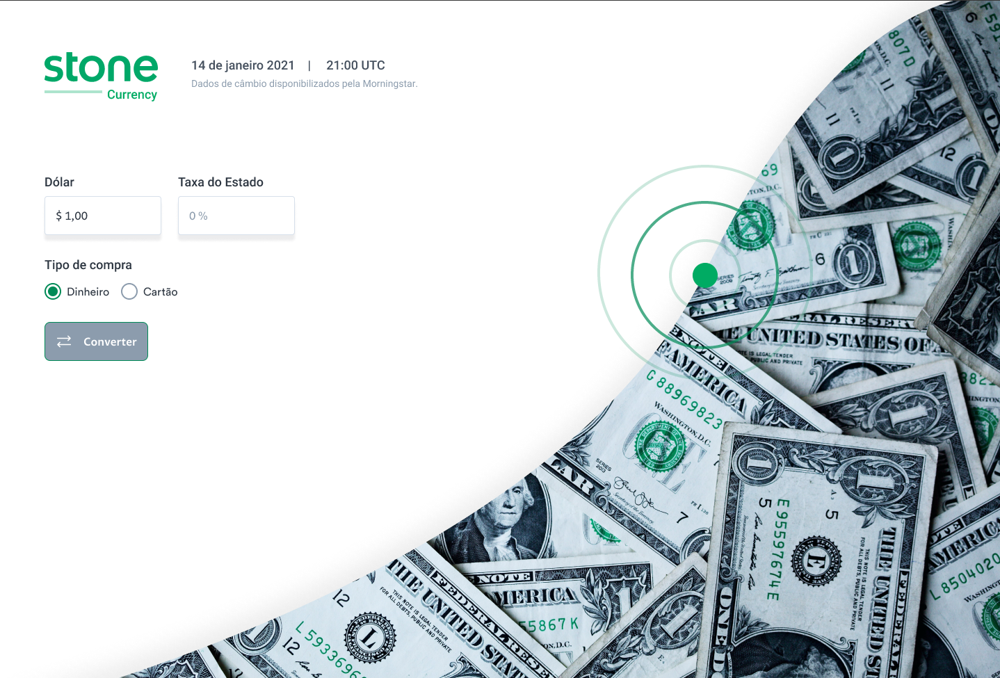

<p align="center">
  
   
  
</p>

<p align="center">
  <a href="#dart-sobre">Sobre</a> &#xa0; | &#xa0;
  <a href="#rocket-requisitos">Requisitos</a> &#xa0; | &#xa0;
  <a href="#warning-critério-de-avaliação">Critério de avaliação</a> &#xa0; | &#xa0;
  <a href="#checkered_flag-começando">Começando</a> &#xa0; | &#xa0;
  <a href="#memo-licença">Licença</a> &#xa0; | &#xa0;
  <a href="https://github.com/geovaneborba" target="_blank">Autor</a>
</p>

<br>

## :dart: Sobre

<p>
  O desafio consiste no desenvolvimento de uma aplicação que realizar a conversão de valores de dólar para real.

A aplicação terá duas etapas, uma para inserir o valor que se deseja converter e outra para mostrar os valores convertidos.

Foi disponibilizado uma API para buscar a cotação do dólar atual.

🎯 <a href="https://github.com/stone-payments/template-desafio-web" target="_blank">Clique aqui para acessar o desafio ⬅️</a>

Além de concluir o desafio eu também adicionei algumas funcionalidades

- Responsividade, adaptei o layout para funcionar em dispositivos móveis
- Validação dos dados no formulário com React Hook Forms junto com o Zod

</p>

<p align="right">(<a href="#top">Voltar para o topo</a>)</p>

## :rocket: Requisitos

A aplicação deve seguir os seguintes requisitos:

- Utilize a fonte do layout
- Utilize React
- Utilize TypeScript
- Crie um cliente HTTP com axios
- Faça testes unitários dos seus componentes
- Utilize uma bilbioteca de cache como swr ou react-query
- Utlize styled-components
- Publique sua aplicação em uma plataforma de deploy rápido (vercel/heroku/- netlify/outros)
- Publique seu código no seu perfil no GitHub em um repositório privado

A aplicação deve mostrar os seguintes dados:

- Cotação do dólar
- IOF
- Total em dólar sem imposto
- Total em dólar com imposto
- Total em real sem imposto
- Total em real com imposto

<p align="right">(<a href="#top">Voltar para o topo</a>)</p>

## :warning: Critério de avaliação

### Entrega

- [x] O resultado final está completo para ser executado?
- [x] O resultado final atende ao que se propõe fazer?
- [x] O resultado final atende totalmente aos requisitos propostos?
- [x] O resultado final é visualmente elegante?

### Boas práticas

- [x] O código está de acordo com o guia de estilo da linguagem?
- [x] O código está bem estruturado?
- [x] O código faz o bom uso de Design Patterns?
- [x] O código possui testes?

### Documentação

- [x] O código foi entregue com um arquivo de README claro de como instalar e codificar no projeto?
- [x] O código possui comentários pertinentes?
- [x] O código está em algum controle de versão?
- [x] Os commits são pequenos e consistentes?
- [x] As mensagens de commit são claras?

<p align="right">(<a href="#top">Voltar para o topo</a>)</p>

## :checkered_flag: Começando

Antes de começar, você precisa ter o [Git](https://git-scm.com) e o [Node](https://nodejs.org/en/) instalados em sua maquina.

```bash
# Clone este repositório
$ git clone https://github.com/geovaneborba/desafio-frontend-stone.git

# Entre na pasta
$ cd desafio-frontend-stone

# Instale as dependências
$ npm install

# Para iniciar o projeto
$ npm run dev

# Para executar os testes
$ npm run test

# Para gerar o coverage dos testes
$ npm run test:coverage

# O app vai inicializar e será informado no terminal o endereço e porta onde estará rodando a aplicação
# geralmente é http://localhost:5173/
```

<p align="right">(<a href="#top">Voltar para o topo</a>)</p>

## :memo: Licença

Este projeto está sob licença MIT. Veja o arquivo [LICENSE](LICENSE.md) para mais detalhes.

<p align="right">(<a href="#top">Voltar para o topo</a>)</p>

<p align="center">Feito com ❤️ por <a href="https://github.com/geovaneborba" target="_blank">Geovane Borba</a></p>
